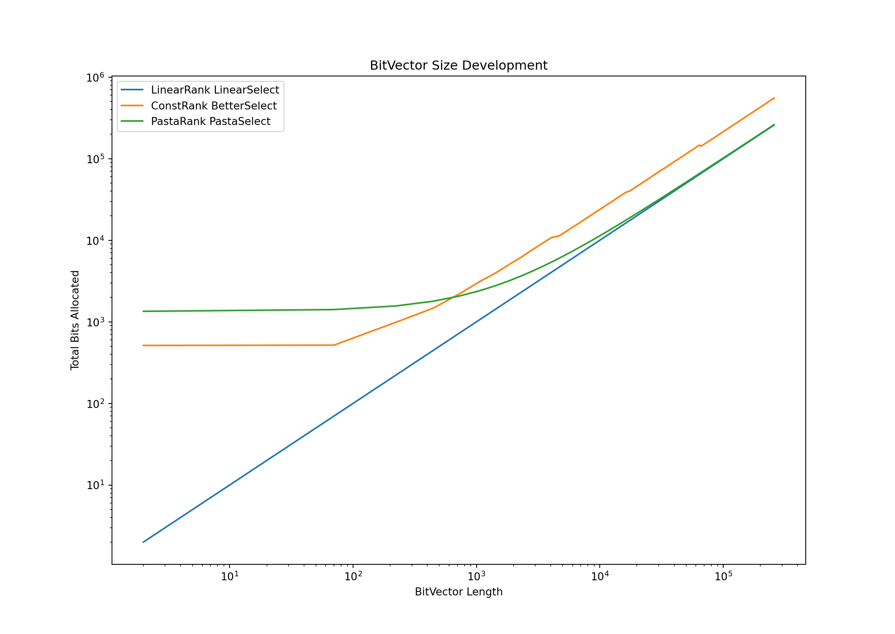
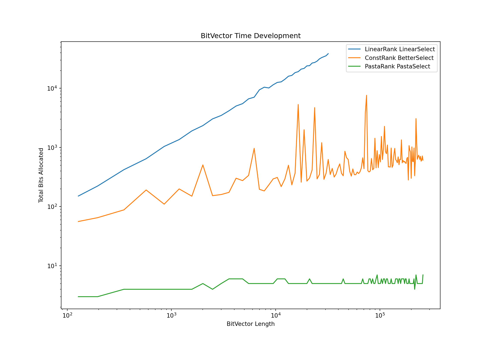

# Project Advanced Data Structures SS 2024

## Author: Robert Andreas Fritsch

### Date: 12.06.2024

---

## Overview

This report provides a comprehensive overview of the advanced data structures implemented for the SS 2024 project. The
focus is on bit manipulation, specifically the development and enhancement of bit containers, and the implementation of
rank and select queries.

---

## Utilities

### Math Wrapper

The header `scr/util.h` contains wrappers around basic math functionalities used throughout the project.

### BitVector

I designed a basic bit container `BitVector` using `std::vector<std::uint64_t>`. This container supports access and
manipulation but does not yet include rank and select queries. Additionally, I designed a `BitsVector` that uses
the `BitVector` to store n-bit elements. Both classes support operations such as access, push, size (number of
elements), and bits (number of bits allocated).

### Rank and Select

To enable rank and select queries, an accessor is used. This accessor utilizes specific Rank and Select Accelerators.
The project implements the following accelerators:

1. `LinearRank`
2. `ConstRank`
3. `LinearSelect`
4. `ConstSelect` (partially working)

---

## Main Method

The main method parses `file1` and performs operations using either `BitVectorAccessor<LinearRank, LinearSelect>` (if a
third parameter is provided) or `BitVectorAccessor<ConstRank, LinearSelect>`. The results are written to `file2`, and
statistics are printed to stdout. Note that parsing is done without any checks, so the program assumes non-corrupt input
files.

---

## Implementation

### LinearRank and LinearSelect

The `LinearRank` and `LinearSelect` are implemented trivially but are efficient for small bit vectors (< ~20000
elements).

### ConstRank

The `ConstRank` is the most advanced technique implemented in this project, providing high performance and correct
answers. Tuning parameters were selected to balance theoretical ideals and practical considerations:

| Parameter          | Theory Value | Real Value |
|--------------------|--------------|------------|
| theory bits        | 1.67772e+07  | 16777216   |
| s_block_bits       | 576          | 504        |
| s_block_count      | 29127.1      | 33289      |
| s_block_elem_size  | 25           | 25         |
| block_bits         | 12           | 12         |
| block_count_per_sb | 48           | 42         |
| block_count_total  | 1.3981e+06   | 1398138    |
| block_elem_size    | 10.1699      | 9          |
| block_data_bits    | 1.42186e+07  | 12583242   |
| s_block_data_bits  | 728178       | 832225     |

The exact choices for these parameters are based on the following calculations:

```cpp
block_bits = Max(1, Log2Half(n));
s_block_bits = FloorX(Max(block_bits + 1, NearestPower2(Log2Pow2(n))) - 1, block_bits);
block_count_per_sb = s_block_bits / block_bits;
s_block_count = CeilDiv(n, s_block_bits);
block_count_total = s_block_count * block_count_per_sb;
block_elem_size = (Log2(s_block_bits) + 1);
s_block_elem_size = (Log2(n) + 1);
block_data_bits = block_elem_size * block_count_total;
s_block_data_bits = s_block_elem_size * s_block_count;
```

Due to time constraints, I haven't fully verified the sizes, but initial observations suggest that the amount of bits
used by the L1 are a bit high. ConstRank constructs its accelerator structures in linear time and is very fast.

### ConstSelect / BetterSelect

`ConstSelect`/`BetterSelect` is not fully implemented yet. Currently, `ConstSelect` supports the first Layer of the
lookup. This however provides only a small speedup for small instances compared to the linear case, but works better for
bigger instances. The implementation so far is very close to theory. So a comparison is not of a bigger interest.

---

## Results

### Size Overhead of the Accelerator Data Structures



The space overhead is linear, as expected.

### Performance Comparison between Variants



The speedup is significant. However, since `ConstSelect` is not fully implemented, I cannot guarantee its performance
for larger bit vectors or its correctness, but the initial results are promising.

---

## Observations

For BitVectors of length `n < 2^16`, an L1 Block can never be sparse because:

```
|B| >= log2(n)^4 -> "B is sparse"
```

Given that `n >= |B|`, a sparse block can only exist if `n >= log2(n)^4`, which is false for `n < 2^16`. Therefore,
for `n < 2^16`, all dense blocks need to store their offsets using `log2(log2(n)^4) + 1` bits.
Since `n < 2^16 -> n < log2(n)^4`, we can use `log2(n) + 1` bits to store the offset, allowing us to use L2 Blocks
directly and ignore L1 Blocks completely.

---

## Fuzz Testing against Reference implementation (Pasta)

The fuzz testing script in `scripts/fuzz_test.py` evaluates the correctness and robustness of a bitvector implementation
by comparing its outputs with a reference implementation under various conditions.

**Execution Summary**:

1. **Setup and Compilation**:
    - Configures the build environment with CMake.
    - Compiles the bitvector executable.

2. **Test Case Generation**:
    - Iterates 48 times, adjusting parameters for the number of operations and bitvector length.
    - Generates a random bitvector and a set of random operations on it.

3. **Execution of Test Cases**:
    - Runs the generated operations using the bitvector implementation in `pasta` and `const` modes.
    - Saves the results to temporary files.

4. **Result Comparison**:
    - Compares outputs from both modes line by line.
    - Logs any discrepancies.

The script automates the generation, execution, and validation of test cases, efficiently identifying inconsistencies
and ensuring the robustness of the bitvector implementation.

---

## Personal Thoughts

I acknowledge that this report is not in the expected format. Due to time constraints, I opted to write my report in
markdown to ensure the content was complete. I hope the content is more important, and I apologize for any
inconvenience.

This project was highly enjoyable. I particularly enjoyed optimizing 'simple' problems and finding straightforward
solutions to complex issues. However, time was a significant constraint, as implementing benchmarks, tests, and
non-trivial algorithms is time-consuming. While I wouldn't have preferred a different project, I hope the tutors
consider the time constraints.

It is unfortunate that `ConstSelect` is not fully implemented yet and only supports layer 1 block offsets.

---
